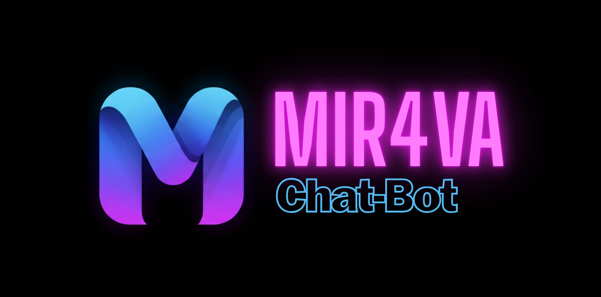

# MIR4VA Chatbot



## Proje Hakkında

MIR4VA Chatbot, kullanıcıların **OOP (Nesne Tabanlı Programlama)** konularında sorularını yanıtlayan bir yapay zeka sohbet uygulamasıdır. Kullanıcılar, sorularını sorarken **temperature** ayarını değiştirerek cevapların yaratıcılık ve çeşitliliğini kontrol edebilirler. 

Proje aynı zamanda kullanıcı ihtiyaçlarını analiz etmek için bir **anket formu** üzerinden veri topladı. Bu istatistikler doğrultusunda chatbotun amacı ve öncelikli kullanım senaryoları belirlendi.

Web sitesi: [MIR4VA](https://mir4va.com)

Proje Yakın Zamanda kendi web sitemizde yayınca olacaktır !.

## Kullanılan Teknolojiler

- Python 3.13  
- Flask (Web API)  
- Google Gemini API (Generative AI)  
- ChromaDB (RAG - Retrieval Augmented Generation)  
- HTML / CSS / JavaScript (Frontend)  
- Railway (Deployment)

## Veri Seti

Bu proje için özel bir veri seti kullanılmamıştır. Chatbot, OOP konusuna dair **ders notları ve PDF dokümanlar** üzerinden bağlam çıkarır ve kullanıcı sorularına yanıt üretir. Form aracılığıyla toplanan istatistikler de kullanım amacının belirlenmesinde referans olarak kullanılmıştır.
OOP notları için Dr. Ali Osman ÇIBIKDİKEN'in ders notları kullanılmıştır.
## Kullanılan Yöntemler

- **RAG (Retrieval Augmented Generation):** Kullanıcının sorusuna en alakalı dokümanları çekerek modele ek bağlam sağlar.  
- **Gemini API ile Generative Model:** Temperature parametresi ile yanıtların çeşitliliğini kontrol eder.  
- **Frontend / Backend Entegrasyonu:** Flask API üzerinden chat mesajları gönderilip alınır.  
- **Form Analizi:** Kullanıcılardan alınan geri bildirimler, chatbotun amacının netleştirilmesi ve iyileştirilmesi için kullanıldı.

## Elde Edilen Sonuçlar

- Kullanıcılar sorularına doğru ve bağlamsal cevaplar alabiliyor.  
- Temperature özelliği sayesinde yanıtların yaratıcılığı ve uzunluğu ayarlanabiliyor.  
- Form ve istatistikler ile chatbotun kullanım amacı belirlenmiş oldu: **OOP eğitimini desteklemek ve kullanıcıların kod örnekleri ile öğrenmesini kolaylaştırmak.**

### Kullanıcıların Bir Chatbottan Beklentileri  

| Soru                                                                       | Evet (%) | Hayır (%) |
|----------------------------------------------------------------------------|----------|-----------|
| Günlük yaşamınızda veya işinizde teknolojiyi sıklıkla kullanıyor musunuz ? | 97       | 3         |
| Yanıtlar yeterince açıklayıcı oluyor mu ?                                  | 66       | 34        |
| Kullandığınız Chatbotun Cevap verirken üretkenliği seçmek ister misiniz ?  | 92       | 8         |

## Deployment


Proje Railway üzerinde deploy edilmiştir ve canlı olarak kullanılabilir:  
[https://mir4va-chatbot-main.up.railway.app](https://mir4va-chatbot-main.up.railway.app)

## Teşekkürler

Nesne Tabanlı Programlama için veri seti hazırlamamda yardımcı olan Dr. Ali Osman ÇIBIKDİKEN hocama
GENERATIVE AI eğitimleri için GLOBALAIHUB mentorlarına ve eğitmenlerine teşekkürlerimi sunarım

## Kurulum ve Çalıştırma

1. Repository’yi klonlayın:
   ```bash
   git clone https://github.com/erdemozkan1/MIR4VA-Chat-Bot.git
2. Gereksinimleri yükleyin:
   ```bash
   pip install -r requirements.txt
3.  .env dosyanızı oluşturun ve GEMINI_API_KEY ekleyin.
    ```bash
    GEMINI_API_KEY= (API adresinizi girin (' ') kullanmadan 
    GEMINI_API_KEY= IgduyTGNornek.....YGFN
4. Veri setlerinizi data klasörüne aktarınız
    ```bash
    pdf ve docx , doc olarak aktarabilirsiniz.

5. Sunucuyu başlatın:
    ```bash
   python chatbot_setup.py
6. Tarayıcıdan http://localhost:5000 adresine gidin.


